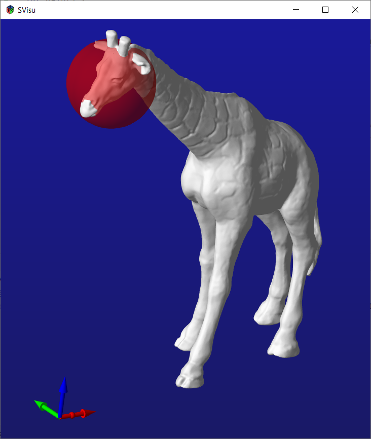

# Visu
3D data viewer, written in C with OpenGL

Based on [pBase](https://github.com/renehorstmann/pbase)

Visu can show various 3D types:
- points (point cloud)
  - points with normals (for shading with light)
  - points with colors
  - points with normals and colors
- lines (lines, strip, loop modes)
  - lines with colors
- meshs (point cloud + mesh indices, or raw as each 3 points)
  - meshs with colors
  - raw mesh with vertex normals
- primitivmeshs
  - plane
  - box
  - sphere
  - halfsphere
  - cylinder
  - cone
  - arrow
  - 3D-Pose coordination system as arrows

Visu(base) itself is written in OpenGL.

gtk/visuwidget uses gtk to create a GtkGlArea and renders visu with it.

So Visu can be easily embedded into a gtk projekt.

SVisu is a simpler version to use Visu and creates a window with the `svisu_show` call.


## Getting started

### Install
see pbase install section.

### Usage
To use pbase in your cmake project:
```cmake
cmake_minimum_required(VERSION 3.0)
project(visutest C)

set(CMAKE_C_STANDARD 11)

add_executable(main main.c)

if (MINGW) # windows
  include_directories("C:/Libraries/include")
endif()

find_library(PBASE_LIB pbase)
find_library(VISU_LIB visu)
target_link_libraries(main ${PBASE_LIB} ${VISU_LIB})
```

### Example
Simple example to use SVisu (for debugging, etc.).

The following two examples will load an stl mesh and render it together with a transparent sphere in SVisu.
The mesh will be loaded with [pbase](https://github.com/renehorstmann/pbase).


#### C
[example_show.c](tests/example_show.c)
```c
#include <stdio.h>
#include <stdlib.h>
#include <pbase/pbase.h>
#include <visu/svisu.h>

int main() {
    pCloud points;
    pMeshIndices indices;
    if (p_io_load_mesh_stl(&points, &indices, "test_io_stl_giraffebinary.stl")) {
        printf("Failed to load mesh: %s", p_error());
        exit(EXIT_FAILURE);
    }

    SVisu *sv = svisu_new(
            true,   // true=orthogonal camera, false=perspective camera
            10      // length of coordination system arrows (<=0 to turn off)
    );
    svisu_mesh(sv, points, indices, SV_WHITE);
    svisu_sphere(sv,
                 (vec3) {{10, 10, 75}},     // mid pos
                 10,                        // radius
                 (vec4) {{1, 0, 0, 0.5}}    // color rgba
    );

    // will open a window to show the mesh and sphere
    svisu_show(sv);

    svisu_kill(&sv);
    p_cloud_kill(&points);
    p_mesh_indices_kill(&indices);
    exit(EXIT_SUCCESS);
}
```

#### Python3
[example_show.py](python/example_show.py)
```python
import pbase as p
import visu as vu
if __name__ == '__main__':
    points, indices = p.io.load_mesh_stl('../tests/data/test_io_stl_giraffebinary.stl')
    sv = vu.SVisu(True, 10)
    sv.mesh(points, indices)    # color=vu.WHITE as default
    sv.sphere([10, 10, 75], 10, [1, 0, 0, 0.75])
    sv.show()

```

#### Additional Features
SVisu has some useful additional features:
- Add trackbars (like OpenCV)
- Add mouse click ray callback (right click the mouse button, to get a 3D ray)
- render callback, will be called each frame
  - process data
  - use svisus Visu to add a Visu Object for rendering
- user defined quit keys
- `svisu_show` returns the last pressed key
- pressing H should reset the camera

#### Camera control
Visu comes with two 3D cameras: orthogonal and perspective.
- Perspective Camera:
  - Use `WASD` to move the camera position
  - Mouse x and y rotates the camera via its x and y axis
  - `QE` rotates the camera via its Z axis
  - `XY` let the camera move up and down
  - The mouse wheel can speed up or lower the move speed
- Orthogonal Camera:
  - The camera will look at a center_pose, which will be at 000 at the start.
  - Mouse x and y rotates the camera around the center pose
  - The mouse will will zoom in and out
  - Holding the mouse wheel and moving the mouse (x and y) will shift the center_pose

## Author

René Horstmann

## Licence

This project is licensed under the MIT License - see the LICENSE file for details

